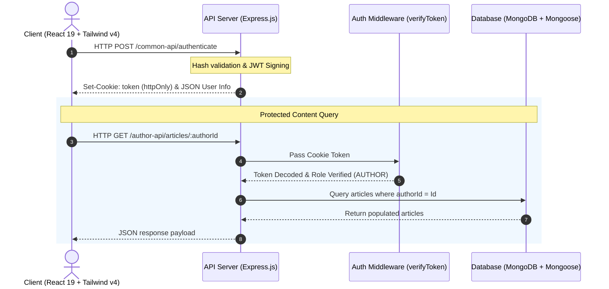

#  Full-Stack Multi-Role Blog Platform

Welcome to the root workspace of the **Multi-Role Blog Platform**—a modern, secure, and performant web application engineered for content creation, community engagement, and system moderation. 

This repository is structured as a monorepo containing two decoupled, high-performance systems:
1.  **[Backend (API Server)](file:///c:/Users/acer/Desktop/vscode/Suntek/week-5/backend/README.md):** A secure, modular Express.js server connected to MongoDB via Mongoose schemas.
2.  **[Frontend (Single-Page App)](file:///c:/Users/acer/Desktop/vscode/Suntek/week-5/frontend/README.md):** A sleek, modern dashboard-driven UI built using React 19, Vite, and Tailwind CSS v4.

---

##  Core Purpose

This platform is designed to provide a secure and fluid environment for publishing articles, fostering discussions through comments, and moderating active user bases. It separates access levels into three distinct roles to guarantee security and distinct user experiences:

*   **Users (Readers):** Public registration. Can browse active articles, read comment feeds, and publish comments of their own.
*   **Authors (Content Creators):** Public registration. Can draft, publish, edit, and toggle active publication status (soft-delete/restore) of their own articles.
*   **Admins (Moderators):** Pre-seeded control accounts. Can view all articles across the platform and moderation-level controls to block or unblock user accounts.

---

##  Key Core Features

###  1. End-to-End Enterprise Security
*   **Salted Hashing:** User passwords are secured before insertion using `bcryptjs`.
*   **httpOnly Session Cookies:** Uses JSON Web Tokens (JWT) stored in HTTP-Only cookies to mitigate Cross-Site Scripting (XSS) and maintain secure stateless sessions.
*   **Modular RBAC Middlewares:** Reusable backend security pipelines verify the user's role on protected endpoints, preventing privilege escalation.

###  2. Component-Driven Responsive Client
*   **Tailwind CSS v4 Engine:** Optimized, blazing-fast CSS layouts designed with modern aesthetics and flexible responsive grids.
*   **Zustand Store:** Clean global state management synchronized dynamically with local storage for seamless session persistence.
*   **State-Aware Navigations:** Conditional headers adapt navigation nodes instantly depending on active roles and session states.

###  3. Structured Data Lifecycle
*   **Nested Comment Sub-documents:** Reader comments are stored as schema-validated nested arrays inside the parent Article documents for optimal database performance.
*   **Relational Populations:** Queries resolve User details dynamically, populating author profiles (`firstName`, `lastName`, `email`) into articles without database redundancies.
*   **Clean Soft Deletes:** Toggles the `isActive` state of articles, hiding them from reader dashboards while retaining archives for authors and admins.

###  4. Uniform Centralized Error Interception
*   **Auto-Translated Schemas:** Translates raw database validation or casting errors into developer-friendly `400 Bad Request` messages.
*   **Automatic Conflict Resolution:** Handles unique key violations (e.g. attempting to register an existing email) with standard `409 Conflict` statuses.

---

##  Full-Stack Architecture Diagram



---

##  Unified Technology Stack

```text
 Suntek/week-5 (Workspace Root)
│
├──  backend/                      # Backend Engine (Express & Mongoose)
│   ├── Run environment:             Node.js
│   ├── Web framework:               Express.js 5.x
│   ├── Database Driver:             Mongoose 9.x / MongoDB
│   └── Security utilities:          bcryptjs, jsonwebtoken, cookie-parser
│
└──  frontend/                     # Frontend Application (React & Vite)
    ├── Framework:                   React 19 (Functional Hooks)
    ├── Tooling / Bundler:           Vite 7.x
    ├── Styling:                     Tailwind CSS v4
    ├── State Management:            Zustand 5.x
    └── Form Handler:                React Hook Form & React Hot Toast
```

---

##  Project Directory Structure

```text
week-5/
├── backend/                  # API Engine (Port 3000 / 5000)
│   ├── APIs/                 # UserAPI, AuthorAPI, AdminAPI, commonApi
│   ├── config/               # Database connection loaders
│   ├── middlewares/          # verifyToken, checkAuthor RBAC security filters
│   ├── models/               # UserModel, ArticleModel schemas
│   ├── services/             # authService (registration, login hashing)
│   ├── .env                  # Port, DB, and Secret environment configs
│   └── server.js             # Express startup file
│
└── frontend/                 # Client Application (Port 5173)
    ├── public/               # Shared static assets
    ├── src/
    │   ├── components/       # Header, Footer, Home, Login, Register, Dashboards
    │   ├── stores/           # Zustand GlobleStore
    │   ├── App.jsx           # React Router DOM trees
    │   └── main.jsx          # DOM rendering root
    ├── package.json          # Vite & Tailwind dependency tree
    └── vite.config.js        # Vite + Tailwind compiler settings
```

---

##  Quick Setup & Running Locally

To run the complete full-stack application on your machine, follow these instructions:

### Step 1: Clone and Configure the Database
1.  Ensure you have **MongoDB** installed and running on your local machine (`mongodb://127.0.0.1:27017`).
2.  Navigate to the `backend/` folder and create a `.env` configuration file:
    ```ini
    PORT=3000
    DB_URL=mongodb://127.0.0.1:27017/blogapp
    JWT_SECRET=your_super_strong_jwt_signing_key_here
    SECRET_KEY=your_super_strong_jwt_signing_key_here
    ```

### Step 2: Start the Backend Server
Open a terminal in the root directory and execute:
```bash
cd backend
npm install
npm start
```
*The terminal should display: `DB connection success` & `server listening on 3000`.*

### Step 3: Start the Frontend Client
Open a second terminal window or tab in the root directory and execute:
```bash
cd frontend
npm install
npm run dev
```
*Vite will compile files and open the server. Navigate to `http://localhost:5173` in your browser.*

---

##  Deep-Dive Sub-Module Documentation

For specific setup guides, detailed file mappings, and comprehensive API routing information:
*    View the **[Backend README.md](file:///c:/Users/acer/Desktop/vscode/Suntek/week-5/backend/README.md)**
*    View the **[Frontend README.md](file:///c:/Users/acer/Desktop/vscode/Suntek/week-5/frontend/README.md)**
