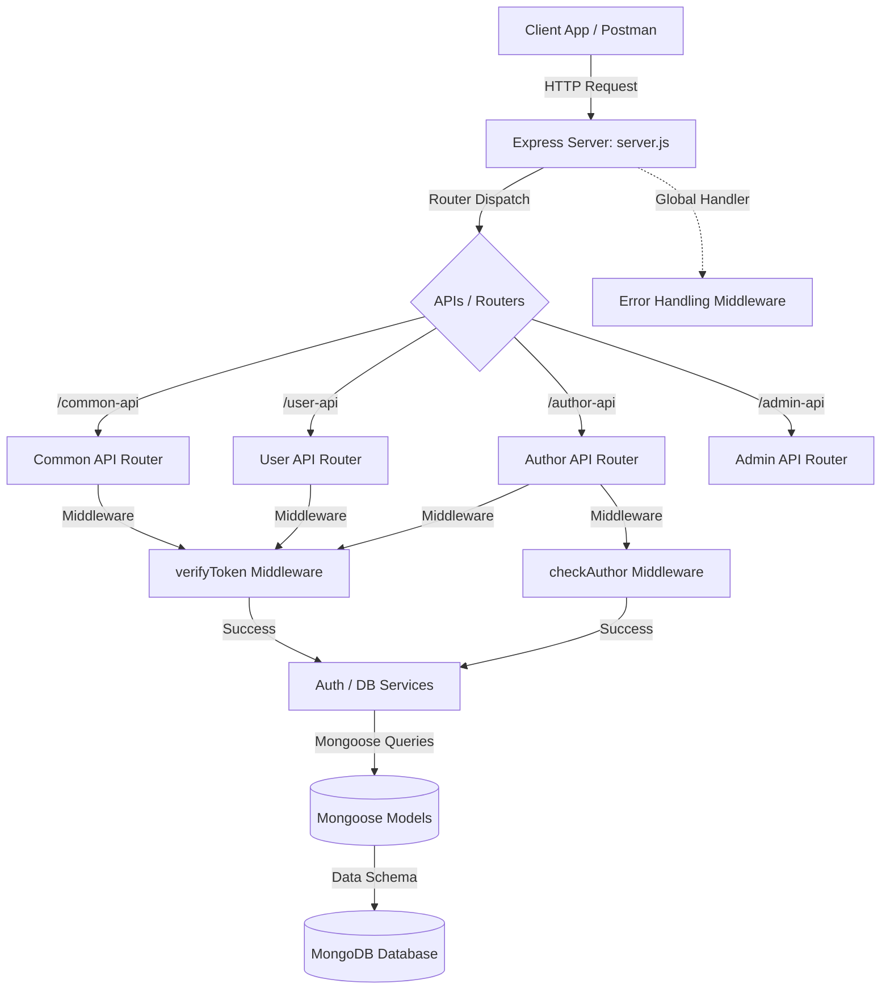

#  Secure Multi-Role Blog Platform Backend

Welcome to the backend engine of the **Multi-Role Blog Platform**. This backend is built using a modern, scalable, and secure stack—**Node.js**, **Express.js**, and **MongoDB** (orchestrated via **Mongoose**). It is engineered with robust security protocols, modular architecture, and fine-grained Role-Based Access Control (RBAC).

---

##  Purpose & Overview

The primary purpose of this backend is to serve as a secure API server that powers a blogging network. It allows three distinct user personas (**Users**, **Authors**, and **Admins**) to interact safely and seamlessly with articles, comments, and account controls:

- **Users (Readers):** Can read articles and interact with them by adding comments.
- **Authors (Creators):** Can write, edit, view, and toggle (soft-delete/restore) their own articles.
- **Admins (Moderators):** Possess global oversight to view all content and restrict/allow access by blocking or unblocking users.

---

##  Key Features

###  1. Advanced Authentication & Security
*   **Encrypted Passwords:** Utilizes `bcryptjs` to dynamically salt and hash user passwords before they touch the database.
*   **JWT Cookie-Based Sessions:** Employs JSON Web Tokens (JWT) stored inside secure, client-hidden `httpOnly` cookies (`lax` state) to protect sessions against Cross-Site Scripting (XSS) and state tampering.
*   **Protected Route Isolation:** Middleware-level authorization validates the presence and contents of tokens on subsequent requests.

###  2. Dynamic Role-Based Access Control (RBAC)
*   **Custom Authorization Middleware:** The modular `verifyToken(...allowedRoles)` middleware validates permissions per route (e.g. restricts author paths strictly to verified `AUTHOR` profiles).
*   **Author Verification Pipeline:** The `checkAuthor` middleware actively monitors database states to ensure that only active, unblocked accounts with an `"AUTHOR"` role can perform operations.

###  3. Comprehensive Article Lifecycle
*   **Mongoose Populate Aggregation:** Seamlessly resolves relationships, attaching the author's primary public details (`firstName`, `lastName`, `email`) when retrieving articles.
*   **Granular Comment Engine:** Embedded sub-documents store user comment history inside their parent article documents.
*   **Soft Deletion:** Toggles the `isActive` state of articles, preventing permanent loss of data while safely removing them from user-facing feeds.

###  4. Global Error & State Management
*   **Uniform JSON Error Pipeline:** A centralized Express error-handling middleware intercepts database/application errors:
    *   `ValidationError` and `CastError` are translated into direct `400 Bad Request` payloads.
    *   Duplicate keys (like duplicate emails, error code `11000`) trigger friendly `409 Conflict` feedback.
    *   Unknown application errors fallback to safe, clean `500 Server Error` responses.

---

##  System Architecture Diagram



---

##  Project Structure

```text
backend/
├── APIs/                     # Express Router configurations (Separated by role)
│   ├── AdminAPI.js           # Administrative moderation endpoints
│   ├── AuthorAPI.js          # Author content & publishing endpoints
│   ├── UserAPI.js            # General reader interaction & commenting endpoints
│   └── commonApi.js          # Unified auth & shared account endpoints
├── config/                   # Dedicated configuration engines (e.g., db connection)
├── middlewares/              # Express intermediate validation interceptors
│   ├── checkAuthor.js        # Validates that an author exists and is active
│   └── verifyToken.js        # Extracts cookies & validates session role permissions
├── models/                   # Strict Mongoose schema models
│   ├── ArticleModel.js       # Article & nested userComment schemas
│   └── UserModel.js          # Unified registration profile schemas
├── services/                 # Business & database helper logic
│   └── authService.js        # Password hashing, user signup, & token signing
├── .env                      # Global environment configurations
├── package.json              # Dependency manifests & script configs
└── server.js                 # Bootstrapper: connects MongoDB & mounts routes
```

---

##  API Endpoints Reference

###  Common & Shared Endpoints (`/common-api`)

| Method | Endpoint | Authorization | Description | Request Body |
| :--- | :--- | :--- | :--- | :--- |
| **POST** | `/common-api/authenticate` | Public | Log in with User, Author, or Admin credentials. Generates and sets httpOnly token cookie. | `{ "email", "password", "role" }` |
| **GET** | `/common-api/logout` | Public | Clears active token cookie. | *None* |
| **PUT** | `/common-api/change-password` | Active Session | Authenticates current password and updates it to a newly-hashed password. | `{ "currentPassword", "newPassword" }` |

###  User (Reader) Endpoints (`/user-api`)

| Method | Endpoint | Authorization | Description | Request Body |
| :--- | :--- | :--- | :--- | :--- |
| **POST** | `/user-api/users` | Public | Registers a new account with the `"USER"` role. | `{ "firstName", "lastName", "email", "password" }` |
| **GET** | `/user-api/articles` | `USER` Role | Retrieves all active articles (`isActive: true`), including author populated details. | *None* |
| **PUT** | `/user-api/articles` | `USER` Role | Appends a comment to an active article. | `{ "user", "articleId", "comment" }` |

###  Author (Creator) Endpoints (`/author-api`)

| Method | Endpoint | Authorization | Description | Request Body |
| :--- | :--- | :--- | :--- | :--- |
| **POST** | `/author-api/users` | Public | Registers a new creator with the `"AUTHOR"` role. | `{ "firstName", "lastName", "email", "password" }` |
| **POST** | `/author-api/articles` | `AUTHOR` Role | Creates and publishes a new article with active status. | `{ "title", "category", "content" }` |
| **GET** | `/author-api/articles/:authorId` | `AUTHOR` Role (Self Only) | Displays all active articles belonging to the requested author ID. | *None* |
| **PUT** | `/author-api/articles` | `AUTHOR` Role (Owner Only) | Edits properties of an active article. | `{ "articleId", "title", "category", "content" }` |
| **PATCH** | `/author-api/articles/:id/status` | `AUTHOR` Role (Owner Only) | Soft-deletes (`isActive: false`) or restores (`isActive: true`) an article. | `{ "isActive" }` |

###  Admin Endpoints (`/admin-api`)

| Method | Endpoint | Authorization | Description | Request Body |
| :--- | :--- | :--- | :--- | :--- |
| **GET** | `/admin-api/articles` | `ADMIN` Role | Retrieves all articles in the system, active or inactive. | *None* |
| **PUT** | `/admin-api/users/:userId/block` | `ADMIN` Role | Disables user authentication capability (blocks them from signing in). | *None* |
| **PUT** | `/admin-api/users/:userId/unblock` | `ADMIN` Role | Restores access permissions for a blocked user. | *None* |

---

##  Configuration Setup

Create a `.env` file in the root of your `backend/` directory and configure the variables:

```ini
# Server Configuration
PORT=5000

# Database Configuration
DB_URL=mongodb://127.0.0.1:27017/blogapp

# Token Secrets
JWT_SECRET=your_super_strong_jwt_signing_key_here
SECRET_KEY=your_super_strong_jwt_signing_key_here

# Asset Storage (Optional Integration)
CLOUD_NAME=your_cloudinary_name
API_KEY=your_cloudinary_api_key
API_SECRET=your_cloudinary_api_secret
```

> [!NOTE]
> Ensure MongoDB is running locally or provide a valid MongoDB Atlas connection string in `DB_URL`.

---

##  Setup & Run Instructions

To download dependencies and start the backend service in developer mode:

1.  **Navigate to the backend folder:**
    ```bash
    cd backend
    ```

2.  **Install project dependencies:**
    ```bash
    npm install
    ```

3.  **Launch the server:**
    *   *For production use:*
        ```bash
        npm start
        ```
    *   *For development use (via Nodemon, if installed globally/locally):*
        ```bash
        npx nodemon server.js
        ```

The terminal should log:
```text
DB connection success
server listening on 5000
```
